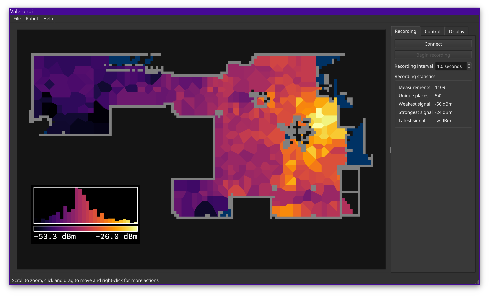

# Valeronoi

Valeronoi (Valetudo + Voronoi) is a companion for [Valetudo](https://valetudo.cloud) for generating WiFi signal strength maps. It visualizes them using a [Voronoi diagram](https://en.wikipedia.org/wiki/Voronoi_diagram).



## Installation

Binary distributions are available for Linux, macOS and Windows (x86_64). They can be found in the [releases](https://github.com/ccoors/Valeronoi/releases).

- Linux: "current" and "legacy" [AppImages](https://appimage.org/). Try "current" first, if that does not work, use "legacy". The "current" AppImage is built on Ubuntu 20.04 LTS (Focal) and Qt 6, so it probably won't run on anything older than that (specifically glibc 2.29). The "legacy" AppImage is built on Ubuntu 18.04 LTS (Bionic) and Qt 5.
- macOS: Built with Qt 6 on macOS 10.15 Catalina, works on Catalina or later on Intel Macs. It also works with Rosetta 2 on M1-based Macs.
- Windows: Cross-compiled on Linux with mingw-w64 and Qt 6. Available as an installer and a portable zip.

## Basic Usage

1. Make sure you have a supported robot running a recent Valetudo version (API v2, Valetudo 2021.03.0 recommended). Having persistent maps is highly recommended.
2. Set up the robot connection in Valeronoi (Robot -> Setup)
3. Connect Valeronoi to the robot using the "Connect" button
4. Verify that the complete, correct map is displayed (!) See below for an explanation.
5. Start recording WiFi measurements by clicking the "Begin recording" button
6. Start a cleanup, either using the controls in the "Control" tab or Valetudo/Home Assistant/... If you don't have persistent maps, make sure to not start a full cleanup! Major map updates can not be handled in Valeronoi.
7. While cleaning, watch the map update
8. After the robot returned to the dock, stop the recording and/or disconnect Valeronoi

### Persistent maps

If the robot decides to generate a new map while recording (which it _will_ do when it encounters enough new territory), all coordinates of the map can change and they will not match the recordings up to that point. **This will mess up your recording.** There is no way to prevent this from happening. If your robot does not support persistent maps, make sure to only record when doing partial cleanups, as a new map will always be generated on a full cleanup.

If you do not have a map, you'll have to do a full cleanup before starting the recording and doing a second (partial) cleanup.

## Support

### Graphics

If the graphics are slow and unresponsive, try the following things in the "Display" tab:

- Disable drawing the floor
- Disabling the "Restrict to ..." checkboxes
- Increase the "Simplify" slider
- Enabling drawing using OpenGL

**Warning:** Using OpenGL may increase or decrease performance, depending on your system. Enabling OpenGL can also lead to various issues, like garbage text or inverted graphics. Valeronoi requests OpenGL 3.2, which should be available on most systems, but may not be available in VMs or Remote Desktop scenarios.

## Building from source

Install the required Libraries using the method of your choice:

- Qt 5.15/6
- CGAL (4.x/5.x should work)

You also need a C++-Compiler capable of C++17. g++ 7 or later works.

Then use the CMake-Project as you would in any other project.

```
mkdir build && cd build
cmake .. -DCMAKE_BUILD_TYPE=Release
make -j
```

### Arch Linux

A `PKGBUILD` for the `valeronoi-git` package is provided in `tools/pkgbuild/valeronoi-git`. To build and install it run `makepkg -si`.

### Building the binary distributions

**You probably don't need this.**
Generating binary distributions for projects using Qt is messy. That is why Valeronoi uses various Docker images known to work to build the Linux AppImage and the Windows Installer. You can find the required scripts and Dockerfiles in `tools/`.

## License

GPLv3
