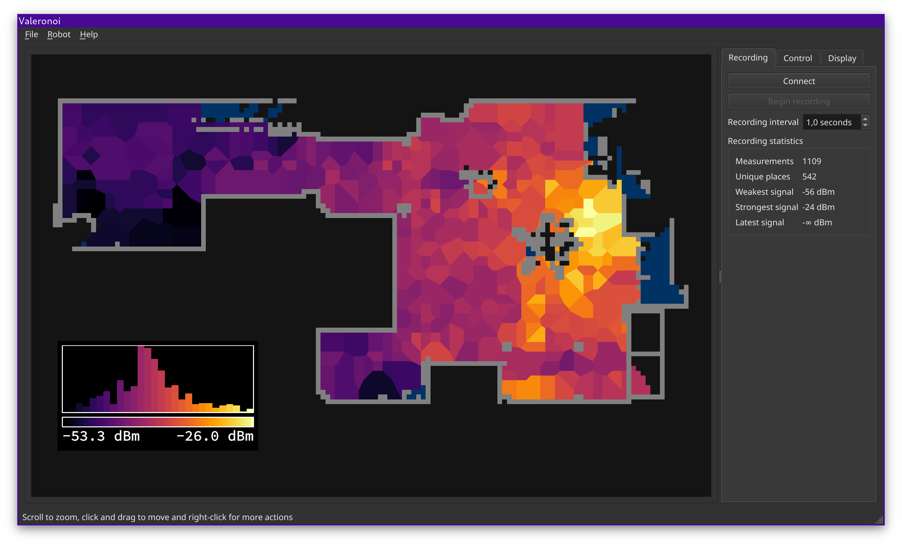

# Valeronoi

Valeronoi (Valetudo + Voronoi) is a companion for [Valetudo](https://valetudo.cloud) for generating WiFi signal strength maps. It visualizes them using a [Voronoi diagram](https://en.wikipedia.org/wiki/Voronoi_diagram).



## Features

- **Real-time WiFi Mapping**: Record WiFi signal strength while your robot cleans.
- **Valetudo Integration**: Connects directly to robots running Valetudo (API v2).
- **Voronoi Visualization**: Beautifully renders signal strength across your floor plan.
- **Export**: Save your generated maps as images for sharing or documentation.
- **Persistent Storage**: Save and load your measurements in the Valeronoi WiFi Map (`.vwm`) format.
- **Robot Control**: Basic controls for starting/stopping cleanups directly from the app.
- **Cross-platform**: Available for Linux, macOS, and Windows.

## Installation

Binary distributions are available for Linux, macOS and Windows (x86_64). They can be found in the [releases](https://github.com/ccoors/Valeronoi/releases).

- **Linux**: Provided as [AppImages](https://appimage.org/). Built on Ubuntu 24.04 LTS with Qt 6.
- **macOS**: Built for macOS 15 (Sequoia) on both Intel and Apple Silicon (Universal/Separate binaries).
- **Windows**: Available as an installer and a portable zip. Requires MSVC redistributable DLLs (included in the installer).

## Basic Usage

1. **Prerequisites**: Ensure your robot is running a recent Valetudo version (API v2). Persistent maps are highly recommended.
2. **Setup**: Configure the robot connection in **Robot → Setup**.
3. **Connect**: Click the **Connect** button to establish a connection with the robot.
4. **Verify**: Ensure the correct map is displayed.
5. **Record**: Click **Begin recording** to start collecting WiFi data.
6. **Clean**: Start a cleanup (either via Valeronoi's **Control** tab or Valetudo).
7. **Monitor**: Watch the map update in real-time as the robot moves.
8. **Finish**: Once the robot returns to the dock, stop the recording and save your work as a `.vwm` file.

### Important: Map Stability

If your robot does not support persistent maps (e.g., older Roborock V1) or the feature is disabled, only record during partial cleanups. A full cleanup may regenerate the map, changing internal coordinates and corrupting the recording.

## Display & Performance

If the visualization is slow, adjust settings in the **Display** tab:

- Disable "Draw floor"
- Uncheck "Restrict to ..." options
- Increase the **Simplify** slider
- Toggle **OpenGL** (Note: Performance may vary; can cause issues in some VMs or Remote Desktop sessions).

## Building from source

### Prerequisites

- **C++ Compiler**: Support for C++17 (e.g., GCC 7+, Clang 5+, MSVC 2017+).
- **Qt 6**: Core, Widgets, Network.
- **CGAL**: Computational Geometry Algorithms Library (v5.x or v6.x recommended).
- **CMake**: Version 3.16 or later.

### Build Instructions

```bash
mkdir build && cd build
cmake .. -DCMAKE_BUILD_TYPE=Release
cmake --build . -j$(nproc)
```

### Arch Linux

A `PKGBUILD` is available in `tools/pkgbuild/valeronoi-git`. You can build and install it using:

```bash
makepkg -si
```

## Development & Testing

Valeronoi includes a test suite to ensure core logic (Voronoi generation, data handling) remains stable.

To build and run tests:

```bash
mkdir build && cd build
cmake ..
cmake --build .
./valeronoi-tests
```

## Contributing

Contributions are welcome! Please see [CONTRIBUTING.md](CONTRIBUTING.md) for guidelines.

## License

GPLv3
